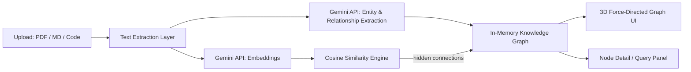

# Graphis — Decentralized Academic Citation & Knowledge Graph Engine

> Built for **PromptWars x Christ University** (Google for Developers × Hack2skill)
> Challenge Track: Graph Theory & Data Synthesis

## The Problem

University research is heavily siloed. Researchers struggle to:
- Find **cross-disciplinary papers** relevant to their work
- Spot **dataset matches** with other departments
- Discover **hidden connections** between disparate theses published across the university

The result: duplicated effort, missed collaborations, and knowledge trapped in departmental silos.

## What Graphis Does

Graphis is an automated knowledge graph builder that:

1. **Ingests** raw PDFs, markdown files, and code repositories
2. **Extracts** entities (authors, papers, topics, datasets, methods, findings) and relationships (citations, shared datasets, methodological overlap) using LLM-based extraction
3. **Builds** a real-time, interactive, multi-dimensional (3D) knowledge graph
4. **Highlights** hidden research collaborations and redundant studies that aren't explicitly cited anywhere — connections a human would take weeks to find manually

## How It Maps to the Problem Statement

| Requirement from brief | How Graphis addresses it |
|---|---|
| Ingests raw PDFs | PDF parsing pipeline extracts full text server-side |
| Ingests markdown files | Native markdown ingestion, no conversion step |
| Ingests code repositories | Parses source files to extract functions/modules as graph entities, linking code artifacts to the papers that describe them |
| Extracts entities and relationships | Gemini-powered structured extraction returns typed entities + typed relationships as JSON |
| Real-time graph | Graph updates live in the UI as each new document finishes processing — no manual refresh |
| Queryable | Click any node to query its direct connections and relationship reasoning |
| Multi-dimensional graph | Rendered in interactive 3D (rotate/zoom/drag), with distinct node types and edge types as separate dimensions of the data |
| Highlights hidden collaborations | Embedding-based cosine similarity surfaces non-cited but topically/methodologically linked documents, rendered as a visually distinct edge type |
| Highlights redundant studies | Same similarity pipeline flags high-overlap studies as duplicate-effort candidates |

## Architecture



**Stack:**
- **Frontend/Backend**: Next.js 14 (App Router) + TypeScript + Tailwind CSS — single deployable unit
- **AI Layer**: Gemini API for structured entity/relationship extraction and text embeddings
- **Graph Rendering**: `react-force-graph-3d` (three.js) for interactive 3D visualization
- **Graph Storage**: In-memory graph structure, scoped per session
- **Deployment**: Vercel (single-command deploy, environment variables for API keys)

### A note on the "expected" GCP stack

The brief's suggested production stack is AlloyDB (pgvector) + Vertex AI + Cloud Run. For this MVP, built under hackathon time constraints, we substituted:

- **Vertex AI → Gemini API directly** (same underlying models, without the IAM/service-account setup overhead)
- **AlloyDB/pgvector → in-memory cosine similarity** (identical algorithm, no persistence needed for a live demo)
- **Cloud Run → Vercel** (faster iteration loop for a time-boxed build)

This was a deliberate trade-off to maximize working functionality within the time limit. The extraction logic, embedding pipeline, and graph schema are written to be **drop-in compatible** with the production stack — swapping the in-memory store for AlloyDB and the direct Gemini calls for Vertex AI endpoints requires no changes to the graph logic itself.

## Prompt Engineering Approach

Since this challenge is prompt-driven, our extraction prompt is designed around:
- **Strict JSON schema output** so entity/relationship parsing is deterministic
- **Few-shot examples** covering ambiguous cases (e.g., a dataset mentioned but not formally cited)
- **Guardrails** against hallucinated relationships — the model is instructed to only assert a relationship when textual evidence supports it, with a confidence field for borderline cases

*(Full extraction prompt included in `/lib/extraction.ts`)*

## Running Locally

```bash
npm install
cp .env.example .env.local   # add your GEMINI_API_KEY
npm run dev
```

## Deployment

```bash
vercel deploy
```

## Team / Build Notes

Built live during PromptWars x Christ University using an AI-assisted, prompt-driven development workflow (Google Antigravity + Gemini 3.5 Flash for scaffolding, Claude for extraction-prompt design and architecture decisions) — in keeping with the challenge's vibe-coding format.
