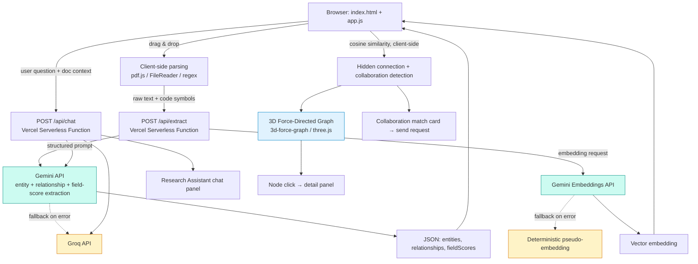

# Graphis — Decentralized Academic Citation & Knowledge Graph Engine

> Built for **PromptWars x Christ University** (Google for Developers × Hack2skill)
> Challenge Track: Graph Theory & Data Synthesis

## The Problem

University research is heavily siloed. Researchers struggle to:
- Find **cross-disciplinary papers** relevant to their work
- Spot **dataset matches** with other departments
- Discover **hidden connections** between disparate theses published across the university

The result: duplicated effort, missed collaborations, and knowledge trapped in departmental silos.

## What Graphis Does

Graphis is an automated knowledge graph builder and research assistant that:

1. **Ingests** raw PDFs, markdown files, and code repositories
2. **Extracts** entities (authors, papers, topics, datasets, methods, findings) and relationships (citations, shared datasets, methodological overlap) using LLM-based extraction
3. **Builds** a real-time, interactive, multi-dimensional (3D) knowledge graph
4. **Highlights** hidden research collaborations and redundant studies that aren't explicitly cited anywhere
5. **Matches collaborators** — when two different researchers' work overlaps but was never cross-referenced, Graphis surfaces it and lets them connect directly
6. **Answers questions** through a research assistant chatbot grounded in the user's own uploaded documents

## How It Maps to the Problem Statement

| Requirement from brief | How Graphis addresses it |
|---|---|
| Ingests raw PDFs | Client-side PDF parsing (pdf.js) extracts full text in-browser |
| Ingests markdown files | Native markdown ingestion, no conversion step |
| Ingests code repositories | Parses source files to extract functions/classes/imports as graph entities |
| Extracts entities and relationships | Gemini-powered structured extraction returns typed entities + typed relationships as JSON |
| Real-time graph | Graph updates live in the UI as each new document finishes processing — no manual refresh |
| Queryable | Click any node to inspect its connections and reasoning, or ask the chatbot directly |
| Multi-dimensional graph | Rendered in interactive 3D (rotate/zoom/drag), with distinct node types and edge types as separate dimensions of the data |
| Highlights hidden collaborations | Embedding-based cosine similarity surfaces non-cited but topically/methodologically linked documents, rendered as a visually distinct edge type |
| Highlights redundant studies | Same similarity pipeline flags high-overlap studies within a user's own uploads as duplicate-effort candidates |

## Architecture



**Stack:**
- **Frontend**: Plain HTML/CSS/JavaScript — no framework, no build step
- **Backend**: Vercel Serverless Functions (`/api/extract`, `/api/chat`) — Node runtime, zero dependencies
- **AI Layer**: Gemini API for structured entity/relationship extraction, embeddings, and chat; Groq wired as an automatic fallback provider if Gemini is unavailable mid-demo
- **Graph Rendering**: `3d-force-graph` (three.js) for interactive 3D visualization, loaded via CDN
- **Graph Storage**: In-browser state, scoped per session
- **Deployment**: Vercel (static site + serverless functions, single deploy, environment variables for API keys)

### Why plain HTML/CSS/JS instead of a framework

This was a deliberate engineering call, not a shortcut. Mid-build, the venue network's SSL configuration broke `npm install` for 30+ minutes with no reliable fix available on-site. Rather than lose the remaining build time to tooling, we rebuilt on a zero-dependency stack: no `npm install`, no bundler, no build step — the app runs by opening a file or deploying directly, and Vercel serverless functions provide the backend without requiring a framework. The trade-off cost some developer convenience; it bought back the only resource that mattered under the deadline — time — and it means the deployed app has fewer points of failure than a framework-based build would.

### A note on the "expected" GCP stack

The brief's suggested production stack is AlloyDB (pgvector) + Vertex AI + Cloud Run. For this MVP, we substituted:

- **Vertex AI → Gemini API called directly** (same underlying models, without the IAM/service-account setup overhead)
- **AlloyDB/pgvector → in-browser cosine similarity** (identical algorithm, no persistence needed for a live demo)
- **Cloud Run → Vercel serverless functions** (zero-config deploy for a time-boxed build)

The extraction logic, embedding pipeline, and graph schema are written to be conceptually compatible with the production stack — swapping in AlloyDB and Vertex AI endpoints later would change the storage/call layer, not the graph logic itself.

## Collaboration Matching

When two different researchers upload documents that are semantically similar but never explicitly cite each other, Graphis surfaces a **Potential Collaborator** card showing the similarity score and both documents involved. A one-click "Send collaboration request" notifies the other researcher — turning a passive graph observation into an actionable connection. In this build, researcher identity is a lightweight local login (name-based) rather than full account infrastructure, since the underlying similarity/matching logic — the part actually being evaluated — is identical either way.

## Research Assistant Chatbot

A conversational panel lets a researcher ask questions in plain language ("what's my most novel finding?", "who should I talk to about my dataset?") instead of manually parsing the graph. The chatbot is grounded in the user's actual uploaded entities and field-relevance scores rather than answering generically, and runs through the same serverless backend as extraction so the API key never reaches the browser.

## Prompt Engineering Approach

Since this challenge is prompt-driven, our extraction prompt is designed around:
- **Strict JSON schema output** so entity/relationship parsing is deterministic
- **Guardrails against hallucinated relationships** — the model is instructed to only assert a relationship when textual evidence supports it, omitting rather than guessing when uncertain
- **A confidence field** on every relationship for borderline cases
- **Field-relevance scoring** in the same call, so cross-disciplinary relevance is assessed from the same pass as entity extraction rather than a separate expensive call

*(Full extraction prompt is in `api/extract.js`; chatbot grounding prompt is in `api/chat.js`)*

## Security

- API keys (`GEMINI_API_KEY`, `GROQ_API_KEY`) live only in Vercel's server-side environment variables — never committed, never sent to the browser
- All AI calls are proxied through serverless functions specifically so the key never touches the client
- Uploaded file types are allowlisted before processing
- User-generated content (filenames, extracted entity names) is HTML-escaped before rendering to prevent injection

## Running Locally

```bash
vercel dev
```
(Opening `index.html` directly via `file://` won't work for the AI features — the `/api` routes need a server. Use `vercel dev` for local testing with your API keys.)

## Deployment

```bash
vercel deploy
```
Add `GEMINI_API_KEY` (and optionally `GROQ_API_KEY`) under Project Settings → Environment Variables before or after first deploy, then redeploy.

## What We'd Build Next

Persistent storage (AlloyDB/pgvector as originally scoped), real multi-user authentication for the collaboration feature, and proactive redundant-study alerts at upload time.

## Team / Build Notes

Built live during PromptWars x Christ University using an AI-assisted, prompt-driven development workflow — Gemini for structured extraction and embeddings, Claude for architecture decisions, extraction-prompt design, and the zero-dependency rebuild after a network failure mid-hackathon.
