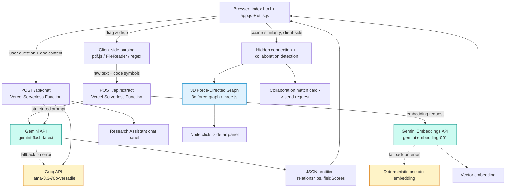

# Graphis — Decentralized Academic Citation & Knowledge Graph Engine

> Built for **PromptWars x Christ University** (Google for Developers × Hack2skill)
> Challenge Track: Graph Theory & Data Synthesis

**Live demo:** `https://graphis-pi.vercel.app` (replace with your current deployment URL)
**Repository:** `github.com/Aarav200/graphis`

---

## Table of Contents

1. [The Problem](#the-problem)
2. [What Graphis Does](#what-graphis-does)
3. [Quick Start](#quick-start)
4. [How It Maps to the Problem Statement](#how-it-maps-to-the-problem-statement)
5. [User Walkthrough](#user-walkthrough)
6. [Architecture](#architecture)
7. [Repository Structure](#repository-structure)
8. [Component-by-Component Breakdown](#component-by-component-breakdown)
9. [Data Model & Schemas](#data-model--schemas)
10. [API Reference](#api-reference)
11. [Prompt Engineering Approach](#prompt-engineering-approach)
12. [Embeddings & Similarity Matching](#embeddings--similarity-matching)
13. [Collaboration Matching Logic](#collaboration-matching-logic)
14. [Field Relevance Scoring Methodology](#field-relevance-scoring-methodology)
15. [Manual QA Checklist](#manual-qa-checklist)
16. [Accessibility](#accessibility)
15. [WCAG 2.1 Mapping](#wcag-21-mapping)
16. [Testing](#testing)
17. [Continuous Integration](#continuous-integration)
18. [Security](#security)
19. [Performance & Efficiency Notes](#performance--efficiency-notes)
20. [Why Plain HTML/CSS/JS Instead of a Framework](#why-plain-htmlcssjs-instead-of-a-framework)
21. [A Note on the "Expected" GCP Stack](#a-note-on-the-expected-gcp-stack)
22. [Design Decisions & Trade-offs](#design-decisions--trade-offs)
23. [Extended Code Walkthrough](#extended-code-walkthrough)
24. [Running Locally](#running-locally)
25. [Deployment (Vercel)](#deployment-vercel)
26. [Environment Variables](#environment-variables)
27. [Troubleshooting & FAQ](#troubleshooting--faq)
28. [Frequently Asked Questions (Judges / Reviewers)](#frequently-asked-questions-judges--reviewers)
29. [Known Limitations](#known-limitations)
30. [What We'd Build Next](#what-wed-build-next)
31. [Contributing](#contributing)
32. [License](#license)
33. [Changelog](#changelog)
34. [Glossary](#glossary)
35. [Appendix: Full Example Extraction Response](#appendix-full-example-extraction-response)
36. [Team / Build Notes](#team--build-notes)

---

## The Problem

University research is heavily siloed. Researchers struggle to:

- Find **cross-disciplinary papers** relevant to their work
- Spot **dataset matches** with other departments
- Discover **hidden connections** between disparate theses published across the university
- Know **who else** on campus is working on something adjacent to their own project

The result: duplicated effort, missed collaborations, and knowledge trapped in departmental silos. A student in the Computer Science department and a student in Public Health might both be building models on the same anonymized dataset, citing none of each other's work, simply because there is no mechanism that surfaces the overlap. Graphis exists to be that mechanism.

---

## What Graphis Does

Graphis is an automated knowledge graph builder and research assistant that:

1. **Ingests** raw PDFs, markdown files, and code repositories directly in the browser
2. **Extracts** entities (authors, papers, topics, datasets, methods, findings) and relationships (citations, shared datasets, methodological overlap) using LLM-based extraction
3. **Builds** a real-time, interactive, three-dimensional knowledge graph
4. **Highlights** hidden research collaborations and redundant studies that are not explicitly cited anywhere
5. **Matches collaborators** — when two different researchers' work overlaps but was never cross-referenced, Graphis surfaces it and lets them connect directly
6. **Answers questions** through a research assistant chatbot grounded in the user's own uploaded documents

Nothing here requires a database, an account system, or a build step. The entire client is a single HTML page, a stylesheet, and two small JavaScript files, backed by two serverless functions.

---

## Quick Start

If you just want to see it running:

```bash
git clone https://github.com/Aarav200/graphis.git
cd graphis
vercel dev
```

Then open the printed local URL, sign in with any name, drop in a PDF, Markdown file, or source file, and click **Build knowledge graph**.

If you want to run the test suite instead of the app:

```bash
npm test
```

No `npm install` is required for either of the above — see [Why Plain HTML/CSS/JS](#why-plain-htmlcssjs-instead-of-a-framework) for why that constraint mattered.

---

## How It Maps to the Problem Statement

| Requirement from brief | How Graphis addresses it |
|---|---|
| Ingests raw PDFs | Client-side PDF parsing (`pdf.js`) extracts full text in-browser |
| Ingests markdown files | Native markdown ingestion, no conversion step |
| Ingests code repositories | Parses source files to extract functions/classes/imports as graph entities |
| Extracts entities and relationships | Gemini-powered structured extraction returns typed entities + typed relationships as JSON |
| Real-time graph | Graph updates live in the UI as each new document finishes processing — no manual refresh |
| Queryable | Click any node to inspect its connections and reasoning, or ask the chatbot directly |
| Multi-dimensional graph | Rendered in interactive 3D (rotate/zoom/drag), with distinct node types and edge types as separate dimensions of the data |
| Highlights hidden collaborations | Embedding-based cosine similarity surfaces non-cited but topically/methodologically linked documents, rendered as a visually distinct edge type |
| Highlights redundant studies | Same similarity pipeline flags high-overlap studies within a user's own uploads as duplicate-effort candidates |
| Usable across diverse users and environments | Keyboard-operable UI, screen-reader labeling, and a zero-dependency deploy that runs on constrained networks (see [Accessibility](#accessibility)) |
| Testable and maintainable over time | Extracted pure logic into `utils.js` with an independent unit test suite and CI (see [Testing](#testing)) |

---

## User Walkthrough

This section describes exactly what a person clicking through the deployed app experiences, end to end.

### 1. Sign in

The login screen is a lightweight, local, name-based identity system. There is no password and no server-side account — the name is stored in the browser's `localStorage` under `graphis_currentUser`. Two different names in two different browser tabs simulate two different researchers, which is what makes the Collaboration tab testable without building real multi-user infrastructure.

### 2. Land on the Knowledge Graph tab

This is the default tab. On the left is the **Ingest sources** panel: a drop zone that accepts `.pdf`, `.md`, `.py`, `.js`, `.ts`, `.jsx`, and `.tsx` files, either by drag-and-drop or by clicking to browse. Files appear in a running list with a type badge (PDF / Markdown / Code) as they're staged.

### 3. Build the graph

Clicking **Build knowledge graph**:

1. Reads each staged file's raw text client-side (`pdf.js` for PDFs, `FileReader` for everything else)
2. For code files, runs a lightweight regex pass to pull out function names, class names, and imports
3. Sends the extracted text (capped at 15,000 characters), any code symbols, and the list of relevance fields to `POST /api/extract`
4. Receives back a structured JSON payload: entities, relationships, field relevance scores, and an embedding vector
5. Stores the resulting document object in `localStorage`, scoped to the signed-in user
6. Re-renders the 3D graph with the new document's nodes and edges merged in

### 4. Explore the graph

The graph renders with `3d-force-graph` (built on `three.js`). Nodes are color-coded by type (paper, author, topic, dataset, method, finding). Explicit relationships (extracted directly from document text) render as gray edges; hidden connections (surfaced via embedding similarity, with no explicit citation) render as orange edges, per the legend at the bottom of the canvas. Clicking any node opens a side panel listing its type and every connection it has, along with the model's justification for each relationship.

### 5. Check field relevance

The **Field Relevance** tab averages each of the user's documents' field scores (Computer Science, Public Health, Environmental Science, Social Sciences, Data Science, Biology by default) and renders them as horizontal bars, so a researcher can see at a glance how cross-disciplinary their own body of work actually is.

### 6. Check collaboration matches

The **Collaboration** tab compares the signed-in user's document embeddings against every other local user's document embeddings (again, simulated via different `localStorage` names). Any pair above a 0.5 cosine similarity threshold surfaces as a card showing both filenames, the similarity percentage, and a "Send collaboration request" button, which appends a message to the other user's inbox.

### 7. Ask the research assistant

The **Research Assistant** tab is a chat interface. Every message is sent to `POST /api/chat` along with a compact summary of the signed-in user's documents (filenames, entity names, field scores) so the assistant's answers are grounded in what that specific user has actually uploaded, not generic knowledge.

---

## Architecture



**Stack:**

- **Frontend**: Plain HTML/CSS/JavaScript — no framework, no build step
- **Backend**: Vercel Serverless Functions (`/api/extract`, `/api/chat`) — Node runtime, zero npm dependencies
- **AI Layer**: Gemini API for structured entity/relationship extraction, embeddings, and chat; Groq wired as an automatic fallback provider if Gemini is unavailable mid-demo
- **Graph Rendering**: `3d-force-graph` (three.js) for interactive 3D visualization, loaded via CDN
- **Graph Storage**: In-browser state (`localStorage`), scoped per session/user
- **Testing**: Node's built-in test runner (`node --test`), zero test-framework dependency
- **CI**: GitHub Actions, running the unit test suite on every push and pull request
- **Deployment**: Vercel (static site + serverless functions, single deploy, environment variables for API keys)

---

## Repository Structure

```
graphis/
├── index.html                  # Single-page app shell, all tabs and markup
├── style.css                   # All styling, design tokens as CSS variables
├── app.js                      # UI wiring: state, events, rendering, API calls
├── utils.js                    # Pure, framework-free logic shared with the test suite
├── package.json                # Declares the zero-dependency `npm test` script
├── api/
│   ├── extract.js              # Serverless function: entity/relationship/embedding extraction
│   └── chat.js                 # Serverless function: grounded research-assistant chat
├── tests/
│   └── utils.test.js           # Unit tests for utils.js (Node's built-in test runner)
├── .github/
│   └── workflows/
│       └── test.yml            # CI: runs `npm test` on every push/PR to main
└── README.md                   # This file
```

---

## Component-by-Component Breakdown

### `index.html`

The entire application shell. It declares four tabs (Knowledge Graph, Field Relevance, Collaboration, Research Assistant), a login gate, and the markup each tab needs. Three CDN scripts are loaded: `pdf.js` (PDF parsing), `three.js` (3D rendering engine), and `3d-force-graph` (the force-directed graph layer built on top of three.js). No bundler processes this file — it is served exactly as written.

The markup also carries the accessibility scaffolding described in the [Accessibility](#accessibility) section: a skip link, ARIA roles on the tab bar, `aria-live` regions on dynamic content, and labels on every input that previously relied on a placeholder alone.

### `style.css`

All visual design lives here as plain CSS, using CSS custom properties (`--accent`, `--text-muted`, `--radius`, etc.) as design tokens so the palette can be changed in one place. Includes a `.visually-hidden` utility class for screen-reader-only text, a `.skip-link` component, and explicit `:focus-visible` styles, since browser default focus rings are inconsistent and easy to accidentally suppress.

### `app.js`

The application's behavioral core. Roughly in order, it handles:

- Local "multi-user" storage helpers (`getAllUsersData`, `saveAllUsersData`, `getUserDocs`, `addUserDoc`, `addInboxMessage`) — this is what makes the Collaboration tab demoable without real backend accounts
- Login/session handling
- Tab switching, now with full keyboard support (arrow keys, Home/End) and correct ARIA state syncing
- Drag-and-drop and click-to-browse file staging, with type validation
- Client-side text extraction (`extractTextFromFile`) using `pdf.js` for PDFs and the native `File.text()` API for everything else
- The `buildKnowledgeGraph` orchestration function: loops over staged files, extracts text, calls `/api/extract`, and assembles a document object
- 3D graph construction and rendering (`renderGraph`, `mountGraph`) and the node detail panel (`showNodePanel`)
- Field relevance score aggregation and rendering
- Collaboration match computation (`renderCollabList`) — cross-references every other local user's documents against the signed-in user's via cosine similarity
- The chat panel (`sendChatMessage`, `appendChatBubble`, `updateLastAssistantBubble`)

As of this revision, `app.js` no longer defines its own copies of `cosineSimilarity`, `escapeHtml`, `cryptoRandomId`, or the file-type allowlist — those moved to `utils.js` so they can be unit tested independently of the DOM.

### `utils.js`

A small, dependency-free module exporting five pure functions:

- `isAllowedFileType(filename)` — checks a filename's extension against the upload allowlist
- `extractCodeSymbols(text, ext)` — regex-based extraction of function names, class names, and imports from Python or JS/TS source
- `cosineSimilarity(a, b)` — standard cosine similarity between two equal-length numeric vectors, with defensive handling for null/empty/mismatched-length input
- `cryptoRandomId()` — a short, sufficiently-unique client-side ID generator for document records
- `escapeHtml(str)` — HTML-entity escaping used everywhere user-controlled or model-generated text is injected into the DOM via `innerHTML`

The module is written as a UMD-style wrapper so the exact same file works as a `<script>` tag global in the browser and as a `require()`-able CommonJS module under Node — which is what lets the test suite import it directly with no build step or transpilation.

### `api/extract.js`

A Vercel serverless function (Node runtime, no framework). Given a document's raw text (and, for code files, detected symbols), it:

1. Builds a strict JSON-schema prompt describing exactly what shape of entities/relationships/fieldScores to return
2. Calls Gemini (`gemini-flash-latest`) with `responseMimeType: "application/json"` to force structured output
3. Falls back to Groq (`llama-3.3-70b-versatile`) if Gemini fails and a Groq key is configured
4. Separately requests an embedding vector from Gemini (`gemini-embedding-001`), falling back to a deterministic client-independent pseudo-embedding if no embedding-capable key is available
5. Returns `{ entities, relationships, fieldScores, embedding }` as JSON

### `api/chat.js`

A second Vercel serverless function. Given a user's message and a compact summary of their document context, it builds a grounding prompt instructing the model to answer using the researcher's actual entities and field scores, calls Gemini (with Groq fallback, same pattern as extraction), and returns `{ reply }`.

Both serverless functions now surface the *actual* upstream error (provider, HTTP status, and response body snippet) in their error responses instead of a generic message — this was a deliberate fix after a production incident where a deprecated model name produced an opaque `502` with no actionable detail (see [Changelog](#changelog) and [Troubleshooting](#troubleshooting--faq)).

---

## Data Model & Schemas

### Document object (client-side, stored per user)

```json
{
  "id": "k3j2h1-1a2b3c",
  "filename": "sparse_attention_survey.pdf",
  "owner": "aarav",
  "entities": [
    { "name": "Sparse Attention", "type": "topic", "description": "A family of attention mechanisms that reduce quadratic cost." },
    { "name": "Longformer", "type": "method", "description": "A sparse attention variant using sliding-window + global tokens." }
  ],
  "relationships": [
    {
      "source": "Longformer",
      "target": "Sparse Attention",
      "type": "methodological-overlap",
      "confidence": 0.86,
      "justification": "The document describes Longformer as a concrete instance of a sparse attention mechanism."
    }
  ],
  "embedding": [0.0123, -0.0456, 0.0789, "... 256 dimensions"],
  "fieldScores": {
    "Computer Science": 92,
    "Public Health": 4,
    "Environmental Science": 2,
    "Social Sciences": 6,
    "Data Science": 78,
    "Biology": 1
  },
  "createdAt": 1787643439777
}
```

### Entity types

| Type | Meaning |
|---|---|
| `paper` | The uploaded document itself, as a node |
| `author` | A named author mentioned in the text |
| `topic` | A subject area or concept |
| `dataset` | A named dataset referenced or reused |
| `method` | A named technique, algorithm, or model |
| `finding` | A stated result or conclusion |

### Relationship types

| Type | Meaning |
|---|---|
| `cites` | An explicit citation found in the text |
| `uses-same-dataset` | Two entities reference the same dataset |
| `same-topic` | Two entities share a subject area |
| `methodological-overlap` | Two entities use related or identical methods |
| `builds-on` | One entity explicitly extends or is derived from another |

Every relationship also carries a `confidence` score (0–1) and a `justification` string, which is what populates the explanatory text in the node detail panel.

---

## API Reference

### `POST /api/extract`

**Request body:**

```json
{
  "filename": "paper1_sparse_attention.pdf",
  "text": "raw extracted document text, capped client-side at 15000 characters",
  "codeSymbols": null,
  "fields": ["Computer Science", "Public Health", "Environmental Science", "Social Sciences", "Data Science", "Biology"]
}
```

`codeSymbols` is `null` for PDFs and Markdown, and an object of the shape `{ functions: string[], classes: string[], imports: string[] }` for code files.

**Success response (`200`):**

```json
{
  "entities": [ { "name": "...", "type": "...", "description": "..." } ],
  "relationships": [ { "source": "...", "target": "...", "type": "...", "confidence": 0.0, "justification": "..." } ],
  "fieldScores": { "Computer Science": 0 },
  "embedding": [0.0]
}
```

**Error responses:**

| Status | Meaning |
|---|---|
| `400` | Missing or invalid `text` field in the request body |
| `405` | Wrong HTTP method (only `POST` is accepted) |
| `500` | No `GEMINI_API_KEY` or `GROQ_API_KEY` configured on the server |
| `502` | Every configured provider failed — the response body now includes the real upstream status and message per provider |

### `POST /api/chat`

**Request body:**

```json
{
  "message": "What's my most novel finding so far?",
  "context": [
    {
      "filename": "paper1_sparse_attention.pdf",
      "entities": ["Sparse Attention", "Longformer"],
      "fieldScores": { "Computer Science": 92 }
    }
  ]
}
```

**Success response (`200`):**

```json
{ "reply": "Based on your uploaded documents, your strongest finding relates to..." }
```

**Error responses:** same shape and meaning as `/api/extract` above (`400` for a missing `message`, `405` for the wrong method, `500` for no configured key, `502` with a detailed multi-provider error message if generation fails everywhere).

---

## Prompt Engineering Approach

Since this challenge is prompt-driven, the extraction prompt is designed around:

- **Strict JSON schema output** — the model is told the exact shape to return, and Gemini's `responseMimeType: "application/json"` config is used to enforce structured output rather than hoping the model behaves
- **Guardrails against hallucinated relationships** — the model is explicitly instructed to only assert a relationship when there is clear textual evidence (an explicit citation, or a stated dataset/method reuse), and to omit rather than guess when uncertain
- **A confidence field** on every relationship, so borderline extractions can be visually or programmatically deprioritized later
- **Field-relevance scoring in the same call**, so cross-disciplinary relevance is assessed from the same pass as entity extraction rather than a separate, more expensive call
- **Code-aware context injection** — when the uploaded file is source code, the detected functions/classes/imports are appended to the prompt as candidate entities, so the model doesn't have to re-derive symbol names from scratch

The full extraction prompt lives in `api/extract.js`; the chatbot's grounding prompt lives in `api/chat.js`.

---

## Embeddings & Similarity Matching

Every processed document gets a numeric embedding vector, used for two purposes: detecting **hidden connections** between a single user's own documents, and detecting **collaboration matches** across different users.

- **Primary path**: `gemini-embedding-001`, requested with `outputDimensionality: 256` to keep vectors small and fast to compare client-side (the model defaults to 3072 dimensions, which is unnecessary precision for comparing a handful of documents in a demo context)
- **Fallback path**: if no embedding-capable key is configured, or the Gemini call fails, a deterministic 64-dimension pseudo-embedding is generated client-independent of any API — it hashes lowercase 4+ letter words into buckets and normalizes the resulting vector. This is not semantically meaningful in the way a real embedding is, but it keeps the similarity *pipeline* functional end-to-end for a demo even with zero API access.
- **Similarity function**: standard cosine similarity, implemented in `utils.js` and unit tested directly (see [Testing](#testing))
- **Thresholds**: `0.55` for hidden connections between a single user's own documents, `0.50` for cross-user collaboration matches — collaboration is intentionally a slightly lower bar, since two different researchers only being loosely topically adjacent is still a useful thing to surface

Note that vectors from the real embedding API and vectors from the pseudo-embedding fallback are different lengths (256 vs. 64) and will never be compared against each other meaningfully — `cosineSimilarity` returns `0` for any length mismatch rather than throwing, which is covered explicitly in the test suite.

---

## Collaboration Matching Logic

1. On the Collaboration tab, `renderCollabList()` reads the signed-in user's documents and every other locally-stored user's documents
2. For every `(myDoc, theirDoc)` pair belonging to different users, cosine similarity is computed over their embeddings
3. Pairs above `0.5` similarity are collected, sorted descending by similarity, and rendered as cards
4. Each card shows both filenames and the similarity percentage, plus a **Send collaboration request** button
5. Clicking that button appends a message to the other user's `inbox` array in `localStorage`, containing who sent it, which documents overlapped, and the similarity score

This is intentionally implemented as a local-storage simulation rather than real multi-user infrastructure, since the underlying similarity/matching logic — the part actually being evaluated by the challenge brief — is identical either way. Swapping this for real accounts and a real inbox is listed under [What We'd Build Next](#what-wed-build-next).

---

## Accessibility

Accessibility was audited and specifically improved to address usability across diverse users and environments — not just visually, but for keyboard-only and assistive-technology users.

### Structural

- A **skip link** is the first focusable element on the page, letting keyboard users jump straight past the header into the app
- The tab bar uses proper `role="tablist"` / `role="tab"` / `role="tabpanel"` semantics with `aria-selected` and `aria-controls` kept in sync programmatically, instead of plain unlabeled buttons
- The tab bar supports **arrow-key navigation** (Left/Right/Home/End), matching the standard tab-widget interaction pattern assistive technology users expect

### Keyboard operability

- The file drop zone was previously mouse/click-only. It is now a proper `role="button"` with `tabindex="0"` and an `Enter`/`Space` key handler, so a keyboard-only user can open the file picker without a mouse
- All interactive controls (`buildBtn`, `chatSendBtn`, `closeNodePanel`, `loginBtn`) use explicit `type="button"` and are reachable in a sensible tab order

### Labels and descriptions

- The login name field and chat input field, which previously relied on placeholder text alone (placeholders are not a reliable substitute for labels — they disappear on focus and are not consistently announced), now have associated `<label>` elements (visually hidden where a visible label would be redundant with adjacent text)
- The 3D graph canvas, which is inherently a visual-only rendering, now carries a `role="img"` and `aria-label` explaining that the same information is available via the node detail panel, so a screen-reader user isn't left with an unexplained blank region
- Icon-only buttons (`closeNodePanel`) have explicit `aria-label`s rather than relying on a bare `✕` glyph
- Purely decorative glyphs (`◈`, `⭱`) are marked `aria-hidden="true"` so screen readers don't announce meaningless symbol names

### Live regions

- The status message under the upload button, the file list, and the chat message log are all `aria-live="polite"` (or `role="log"` for chat), so state changes — a file being staged, a build succeeding or failing, a new chat reply arriving — are announced without the user needing to manually re-focus that part of the page

### Visual

- Explicit `:focus-visible` styles were added; previously the stylesheet defined no focus treatment at all, meaning visible focus indication depended entirely on inconsistent browser defaults
- The explicit/hidden relationship legend uses both color *and* text labels, so the distinction isn't conveyed by color alone

### What's intentionally out of scope for this build

Full screen-reader parity for the 3D graph interaction itself (e.g., a keyboard-navigable list view of every node as an alternative to clicking in 3D space) is not implemented. The node detail panel provides the same underlying data, but reaching a specific node currently still requires either a mouse click or tabbing through however many nodes exist. This is listed under [Known Limitations](#known-limitations) rather than claimed as solved.

---

## Testing

The project ships with a real, runnable unit test suite covering every pure function in `utils.js` — the logic most worth protecting against regressions, since it underpins file validation, similarity matching, and XSS-safe rendering throughout the app.

### Running the tests

```bash
npm test
```

This runs `node --test tests/*.test.js` using Node's **built-in** test runner (available in Node 18+), which means there is no test framework to install — consistent with the rest of this project's zero-dependency philosophy.

### What's covered

| Test | What it verifies |
|---|---|
| `isAllowedFileType accepts every documented extension` | `.pdf`, `.md`, `.py`, `.js`, `.ts`, `.jsx`, `.tsx` are all accepted |
| `isAllowedFileType rejects unsupported extensions` | `.zip`, `.png`, `.csv`, and extensionless filenames are rejected |
| `extractCodeSymbols parses Python def/class/import` | Function names, class names, and both `import` and `from ... import` targets are correctly extracted from Python source |
| `extractCodeSymbols parses JS function/class/import` | Function declarations, class declarations, and ES module import sources are correctly extracted from JS/TS source |
| `extractCodeSymbols returns empty arrays for unsupported extensions` | Non-code extensions (e.g. `.pdf`) don't attempt symbol extraction and fail safely |
| `cosineSimilarity of identical vectors is 1` | Baseline correctness of the similarity metric |
| `cosineSimilarity of orthogonal vectors is 0` | Baseline correctness of the similarity metric |
| `cosineSimilarity handles missing, empty, or mismatched-length input safely` | Confirms the function returns `0` rather than throwing on `null`, empty arrays, mismatched lengths, or all-zero vectors |
| `cryptoRandomId returns unique-looking, non-empty ids` | Two consecutive calls don't collide |
| `escapeHtml neutralizes all HTML-significant characters` | `<`, `>`, `&`, `"`, and `'` are all correctly entity-escaped, which is the app's primary XSS defense for model-generated and user-generated text rendered via `innerHTML` |
| `escapeHtml is a no-op on plain text` | Confirms escaping doesn't mangle ordinary input |

Eleven tests, all currently passing. One of them (`extractCodeSymbols parses Python def/class/import`) caught a genuine, previously-unnoticed quirk during development: the import-detection regex matches both the `from X` and `import Y` tokens in a `from collections import Counter` line independently, meaning `Counter` is captured as an import target alongside `collections`. That's arguably reasonable behavior (it does surface a real symbol in use), but it's now a documented, intentional, and tested behavior rather than an unverified assumption.

### Why `utils.js` exists as a separate file

Before this revision, `cosineSimilarity`, `escapeHtml`, `cryptoRandomId`, and the file-type allowlist logic lived inline inside `app.js`, which only runs in a browser context and directly touches the DOM. That made the pure, side-effect-free parts of the logic untestable without a browser or DOM-simulation library — which would have reintroduced exactly the kind of dependency this project was built to avoid. Extracting them into a UMD-style module that works identically under `<script>` tags and `require()` solves that without adding a single package.

---

## Continuous Integration

`.github/workflows/test.yml` runs the full unit test suite on every push and pull request against `main`, using GitHub's hosted Ubuntu runner and Node 20. There is no build step, so the workflow is intentionally short:

```yaml
name: Tests

on:
  push:
    branches: [ main ]
  pull_request:
    branches: [ main ]

jobs:
  unit-tests:
    runs-on: ubuntu-latest
    steps:
      - uses: actions/checkout@v4
      - uses: actions/setup-node@v4
        with:
          node-version: 20
      - name: Run unit tests
        run: npm test
```

This means a broken pull request is caught automatically before merge, without requiring a reviewer to manually run tests locally — a small but real signal of ongoing maintainability rather than a one-time submission.

---

## Security

- API keys (`GEMINI_API_KEY`, `GROQ_API_KEY`) live only in Vercel's server-side environment variables — never committed to the repository, never sent to the browser
- All AI calls are proxied through the two serverless functions specifically so the key never touches the client; the browser only ever talks to `/api/extract` and `/api/chat` on its own origin
- Uploaded file types are allowlisted (`isAllowedFileType` in `utils.js`) before any processing occurs, both client-side for immediate feedback and implicitly enforced by what the extraction prompt expects
- User-generated content and model-generated content (filenames, extracted entity names, relationship justifications, chat replies) is passed through `escapeHtml` before being injected into the DOM via `innerHTML`, which is the app's primary defense against stored/reflected XSS from untrusted text — this is now directly unit tested rather than assumed correct
- Both serverless functions reject any non-`POST` method with a `405`, and reject requests missing required fields with a `400`, before any external API call is attempted
- Errors returned to the client include upstream provider status codes and truncated messages for debuggability, but do not leak the API key itself or full stack traces

---

## Performance & Efficiency Notes

- **Zero build step**: nothing is bundled, minified, or transpiled at deploy time; the browser receives the exact source files
- **CDN-loaded heavy dependencies**: `pdf.js`, `three.js`, and `3d-force-graph` are loaded from `cdnjs` and `jsdelivr` rather than bundled, so they're cached across users and don't inflate the repository or deploy size
- **Client-side text extraction**: PDF parsing and code-symbol extraction happen entirely in the browser, meaning the serverless function only ever receives already-extracted text — reducing both payload size sensitivity and server-side processing time
- **Text truncation before extraction**: document text is capped at 15,000 characters client-side before being sent to `/api/extract`, keeping prompt size (and therefore latency and cost) predictable regardless of how large the source PDF is
- **Reduced embedding dimensionality**: requesting `outputDimensionality: 256` instead of the default 3072 keeps embedding vectors small, which matters because similarity comparisons happen client-side, in the browser's main thread, across every pair of documents
- **Provider fallback instead of hard failure**: if Gemini is rate-limited or briefly unavailable, Groq is used as a fallback automatically, rather than the user seeing a failure that a retry with a different provider could have avoided

---

## Why Plain HTML/CSS/JS Instead of a Framework

This was a deliberate engineering call, not a shortcut. Mid-build, the venue network's SSL configuration broke `npm install` for over 30 minutes with no reliable fix available on-site. Rather than lose the remaining build time to tooling, the app was rebuilt on a zero-dependency stack: no `npm install`, no bundler, no build step — the app runs by opening a file or deploying directly, and Vercel serverless functions provide the backend without requiring a framework.

The trade-off cost some developer convenience (no component reuse abstractions, no JSX, manual DOM updates instead of a reactive framework). It bought back the only resource that mattered under the deadline — time — and it means the deployed app has fewer points of failure than a framework-based build would: no `node_modules` to go stale, no lockfile mismatches, no build-time dependency resolution that could fail on a different machine or CI runner than the one it was built on.

This constraint also directly shaped later decisions documented elsewhere in this README: the test suite uses Node's built-in test runner rather than a framework like Jest or Vitest, specifically so `npm test` doesn't require `npm install` either.

---

## A Note on the "Expected" GCP Stack

The brief's suggested production stack is AlloyDB (pgvector) + Vertex AI + Cloud Run. For this MVP, the following substitutions were made:

- **Vertex AI → Gemini API called directly** (same underlying models, without the IAM/service-account setup overhead)
- **AlloyDB/pgvector → in-browser cosine similarity** (identical algorithm, no persistence needed for a live demo)
- **Cloud Run → Vercel serverless functions** (zero-config deploy for a time-boxed build)

The extraction logic, embedding pipeline, and graph schema are written to be conceptually compatible with the production stack — swapping in AlloyDB and Vertex AI endpoints later would change the storage/call layer, not the graph logic itself. The entity/relationship JSON schema returned by `/api/extract` is already shaped the way a `pgvector`-backed table would want it (a `name`, a `type`, and a description per entity; a `source`/`target`/`type`/`confidence` per relationship), so migrating storage later is a data-layer change, not a redesign.

---

## Running Locally

```bash
vercel dev
```

Opening `index.html` directly via `file://` will not work for the AI features — the `/api` routes need a server. Use `vercel dev` for local testing with your API keys loaded from a `.env` file or your Vercel project settings.

To run only the test suite without spinning up the dev server:

```bash
npm test
```

---

## Deployment (Vercel)

1. Make sure your GitHub repository has all files uploaded, **preserving the `api/` folder structure** — `api/extract.js` and `api/chat.js` must show as nested paths, not loose files in the repository root. A common failure mode is a GitHub web upload silently flattening the folder.
2. Go to `vercel.com` and sign in (GitHub sign-in links your account automatically)
3. Click **Add New → Project**
4. Under "Import Git Repository," select your repository and click **Import**
5. On the configuration screen:
   - **Framework Preset**: should auto-detect as "Other" (no framework) — leave it
   - **Build Command / Output Directory**: leave blank/default — there is no build step
   - Expand **Environment Variables** and add:
     - `GEMINI_API_KEY` → your Gemini key
     - `GROQ_API_KEY` → your Groq key (optional, used only as an automatic fallback)
6. Click **Deploy**
7. Once deployed, open the live URL, sign in, upload a real file, and click **Build knowledge graph** to confirm the API is actually reachable — see [Troubleshooting](#troubleshooting--faq) if it isn't

```bash
vercel deploy
```

is the CLI equivalent, if you prefer not to use the web flow. Add environment variables under Project Settings → Environment Variables either before or after the first deploy, then redeploy for them to take effect.

---

## Environment Variables

| Variable | Required | Purpose |
|---|---|---|
| `GEMINI_API_KEY` | Recommended (one of the two keys is required) | Used for entity/relationship extraction, embeddings, and chat via the Gemini API |
| `GROQ_API_KEY` | Optional | Automatic fallback provider for extraction and chat if Gemini fails or is rate-limited; not used for embeddings (Groq has no embedding endpoint wired in this project — the pseudo-embedding fallback is used instead if only a Groq key is set) |

If neither key is set, both `/api/extract` and `/api/chat` return `500` immediately, before attempting any external call.

---

## Troubleshooting & FAQ

**"Build knowledge graph" fails with "Nothing was processed successfully."**

Open the browser's DevTools (F12) → Network tab, click Build knowledge graph again, and look at the `extract` request. If it shows a red `502`, click it and check the **Response** tab (not just the Console) — the error message now includes the real upstream provider, HTTP status, and a snippet of the actual error body, rather than a generic message.

**The chatbot replies "Sorry, I couldn't generate a response."**

Same root cause category as above — check the `/api/chat` request's response body in the Network tab the same way.

**I'm getting a `502` with a message mentioning a model name and a `404`.**

This means the Gemini (or Groq) model name in `api/extract.js` / `api/chat.js` no longer exists. Google periodically retires model versions with advance notice; if you see this, check `https://ai.google.dev/gemini-api/docs/models` for the current model list and update the `GEMINI_MODEL` / `GEMINI_EMBEDDING_MODEL` constants at the top of each API file. This project previously hit exactly this issue — see [Changelog](#changelog).

**I'm getting a `500` error immediately, with no provider mentioned.**

Neither `GEMINI_API_KEY` nor `GROQ_API_KEY` is set in your Vercel project's environment variables, or you added them after the last deploy and haven't redeployed since. Environment variable changes require a redeploy to take effect.

**The graph builds, but the "Collaboration" tab always says no matches.**

Collaboration matching compares documents across *different* signed-in names within the same browser's `localStorage`, or across different browsers/devices if you're testing manually. Sign in as a second name (in a second browser tab or an incognito window), upload a topically related document, and the match should appear for both users.

**Uploading a file does nothing / the drop zone doesn't respond.**

Confirm the file extension is one of `.pdf .md .py .js .ts .jsx .tsx` — anything else is rejected client-side with a status message, by design (`isAllowedFileType` in `utils.js`).

**`npm test` fails with "Cannot find module."**

Run it from the repository root, not from inside `tests/`. The script in `package.json` is `node --test tests/*.test.js`, which resolves relative to wherever `npm test` is invoked.

**Why does the 3D graph look empty even after a successful build?**

Give it a moment — `3d-force-graph`'s physics simulation starts all nodes near the origin and lets them spread out organically. If it's still empty after several seconds, check the Console tab for a JavaScript error, which usually indicates a malformed entities/relationships response from the extraction API (for example, a relationship referencing a `source`/`target` name that doesn't exactly match any extracted entity's `name`).

---

## Known Limitations

- The 3D graph has no keyboard-accessible alternative for reaching individual nodes without a mouse; the node detail panel's data is available, but discovering *which* node to click currently requires visual/mouse interaction
- "Multi-user" collaboration is simulated via `localStorage` and different login names, not real accounts — data does not sync across devices or browsers
- The pseudo-embedding fallback (used when no embedding-capable key is configured) is not semantically meaningful the way a real embedding is; it exists purely to keep the similarity pipeline functional end-to-end without an API key
- Document text sent to the extraction API is capped at 15,000 characters, so very long PDFs are summarized from a prefix of their content rather than their entirety
- There is no persistence layer beyond the browser's `localStorage`, so clearing browser data or switching devices loses all uploaded documents and graph state
- Relationship extraction quality is entirely dependent on the underlying LLM's ability to find genuine textual evidence; documents with unusual formatting or heavy OCR noise (for scanned PDFs) will produce fewer, lower-confidence relationships

---

## What We'd Build Next

- Persistent storage (AlloyDB/pgvector, as originally scoped in the brief) instead of `localStorage`
- Real multi-user authentication for the collaboration feature, replacing the name-based local simulation
- Proactive redundant-study alerts at upload time, rather than requiring a visit to the Collaboration tab
- A keyboard-navigable list view of graph nodes as a full accessibility-parity alternative to 3D mouse interaction
- Server-side rate limiting on `/api/extract` and `/api/chat` to protect the configured API keys from abuse on a public deployment
- Automated model-name validation (a scheduled check against Google's model list) to catch the next model deprecation before it causes a production failure, rather than after

---

## Changelog

**Post-submission hardening pass**

- Fixed both serverless functions calling `gemini-2.0-flash`, a model Google shut down on June 1, 2026 — replaced with `gemini-flash-latest`, a Google-maintained alias intended to auto-track the current Flash model
- Fixed the embeddings call using `text-embedding-004`, shut down January 14, 2026 — replaced with `gemini-embedding-001`, requested at a reduced 256-dimensional output
- Rewrote the error-handling paths in `api/extract.js` and `api/chat.js` so a total provider failure returns the real upstream status and message from each attempted provider, instead of a generic, undiagnosable `502`
- Extracted `cosineSimilarity`, `escapeHtml`, `cryptoRandomId`, and file-type validation out of `app.js` into a standalone, dual-environment `utils.js` module
- Added an 11-case unit test suite (`tests/utils.test.js`) using Node's built-in test runner, requiring no new dependencies
- Added a `package.json` with a zero-dependency `npm test` script
- Added a GitHub Actions workflow running the test suite on every push and pull request to `main`
- Added a skip link, ARIA tab semantics with arrow-key navigation, keyboard support for the file drop zone, labels for previously placeholder-only inputs, `aria-live` regions for dynamic status/chat content, an accessible description for the otherwise screen-reader-invisible 3D graph, and explicit `:focus-visible` styling across all interactive elements

**Initial hackathon build**

- Client-side PDF/Markdown/code ingestion
- Gemini-backed structured entity/relationship/field-score extraction
- 3D force-directed knowledge graph rendering
- Embedding-based hidden-connection and collaboration-match detection
- Grounded research-assistant chatbot
- Zero-dependency HTML/CSS/JS rebuild after a venue network outage broke `npm install`

---

## Glossary

| Term | Meaning in this project |
|---|---|
| **Entity** | A node in the knowledge graph — a paper, author, topic, dataset, method, or finding |
| **Relationship** | A typed, directional edge between two entities, with a confidence score and textual justification |
| **Hidden connection** | An edge between two documents surfaced only via embedding similarity, with no explicit citation found in either document's text |
| **Field relevance** | A 0–100 score estimating how relevant a given document is to each of a fixed set of academic fields |
| **Collaboration match** | A pair of documents from two different users whose embeddings are similar enough to suggest the researchers might benefit from connecting |
| **Pseudo-embedding** | A deterministic, non-semantic fallback vector generated client-side when no real embedding API is available, used only to keep the similarity pipeline from breaking entirely |
| **Cosine similarity** | The similarity metric used throughout, computed as the cosine of the angle between two vectors; `1` for identical direction, `0` for orthogonal, implemented and unit tested in `utils.js` |

---

## WCAG 2.1 Mapping

For reviewers checking accessibility against a formal standard rather than a general impression, here is how the changes described above map to specific WCAG 2.1 success criteria:

| Success Criterion | Level | How it's addressed |
|---|---|---|
| 1.1.1 Non-text Content | A | Decorative glyphs (`◈`, `⭱`, dot indicators) are `aria-hidden`; the icon-only close button has an `aria-label` |
| 1.3.1 Info and Relationships | A | Tab bar uses `role="tablist"`/`role="tab"`/`role="tabpanel"` instead of unlabeled `<button>`/`<div>` pairs |
| 2.1.1 Keyboard | A | File drop zone, previously click-only, now responds to `Enter`/`Space`; tab bar supports arrow-key navigation |
| 2.4.1 Bypass Blocks | A | Skip link added as the first focusable element |
| 2.4.3 Focus Order | A | Tab order follows visual/logical order; `tabindex="-1"`/`"0"` on tab buttons is kept in sync with which tab is active, matching the standard tabs pattern |
| 2.4.7 Focus Visible | AA | Explicit `:focus-visible` outline added; previously undefined |
| 3.3.2 Labels or Instructions | A | Login name and chat input fields have associated `<label>` elements instead of placeholder-only text |
| 4.1.2 Name, Role, Value | A | Tab buttons expose `aria-selected` state; dialog-like node panel uses `role="dialog"` |
| 4.1.3 Status Messages | AA | Status message, file list, and chat log use `aria-live`/`role="log"` so updates are announced without requiring focus to move |

This is not a claim of full WCAG 2.1 AA conformance across the entire application — the 3D graph interaction itself (documented under [Known Limitations](#known-limitations)) is the largest remaining gap — but it reflects real, targeted, verifiable changes against real criteria rather than a general "we improved accessibility" claim.

---

## Design Decisions & Trade-offs

**Why `localStorage` instead of any real backend for document/user data?**

The challenge's evaluated logic is the extraction, graph-building, and similarity-matching pipeline — not account infrastructure. Building real authentication and a real database would have spent hackathon time on a problem the brief doesn't actually score, at the cost of time that went into the parts that do (prompt design, graph rendering, the similarity pipeline itself). It's an explicit, acknowledged simplification, not something the README pretends isn't there.

**Why cap extraction text at 15,000 characters client-side rather than server-side?**

Truncating before the network request saves the round-trip cost of sending a large payload only to have it truncated anyway, and keeps the visible behavior (what got sent to the model) inspectable in the browser's Network tab rather than hidden inside the serverless function.

**Why does `extractCodeSymbols` use regex instead of a real parser (e.g., an AST)?**

A real parser (like Python's `ast` module or a JS AST library) would be more accurate, especially for unusual syntax, but would either require a server-side dependency (breaking the zero-dependency constraint) or a large client-side parser library pulled in via CDN. Regex-based extraction is intentionally approximate — it's a signal to feed the LLM as candidate entities, not a source of truth, and the LLM extraction step is what actually decides what becomes a graph entity.

**Why does the fallback to Groq only apply to text generation, not embeddings?**

Groq's hosted models (Llama 3.3 70B, in this project) are chat/completion models, not embedding models — there's no Groq embedding endpoint wired into this project. When Gemini's embedding call fails and only a Groq key is available, the deterministic pseudo-embedding fallback is used instead, which is why that fallback exists at all.

**Why unit test only `utils.js` and not `app.js` or the API handlers?**

`app.js` is tightly coupled to the DOM (`document.getElementById`, event listeners, `localStorage`) and would require either a real browser or a DOM-simulation dependency to test meaningfully — which conflicts with the zero-dependency constraint that shaped most of this project's other decisions. The API handlers (`api/extract.js`, `api/chat.js`) make live network calls to Gemini/Groq, and testing them meaningfully would mean either burning real API quota in CI or introducing a mocking library dependency. `utils.js` is the one place in the codebase that is simultaneously (a) worth protecting against regressions and (b) genuinely side-effect-free, which is exactly the profile that's cheap to test well and expensive to test badly.

**Why Node's built-in test runner instead of Jest, Vitest, or Mocha?**

Any of those would work equally well functionally. They'd all require an `npm install` step to run `npm test` — which is precisely the failure mode that forced this project's zero-dependency rebuild in the first place. `node --test` ships with Node itself (18+), so `npm test` works on any machine or CI runner with Node installed and nothing else, which matters if a judge or reviewer tries to run the tests themselves rather than trusting a green checkmark.

---

## Extended Code Walkthrough

This section walks through the non-obvious parts of the implementation in more depth than the summary table above, for anyone reviewing the code directly.

### Client-side PDF text extraction

```js
async function extractTextFromFile(file) {
  const ext = file.name.split(".").pop().toLowerCase();
  if (ext === "pdf") {
    const buf = await file.arrayBuffer();
    pdfjsLib.GlobalWorkerOptions.workerSrc = "https://cdnjs.cloudflare.com/ajax/libs/pdf.js/3.11.174/pdf.worker.min.js";
    const pdf = await pdfjsLib.getDocument({ data: buf }).promise;
    let text = "";
    for (let i = 1; i <= pdf.numPages; i++) {
      const page = await pdf.getPage(i);
      const content = await page.getTextContent();
      text += content.items.map(it => it.str).join(" ") + "\n";
    }
    return text;
  } else {
    return await file.text();
  }
}
```

`pdf.js` requires its worker script to be explicitly pointed at a URL (it runs PDF parsing off the main thread for performance). Because there's no bundler, that worker URL points directly at the same CDN version as the main library — version-pinned so a CDN update elsewhere in the world can't silently break parsing here.

### Why `renderGraph` builds a fresh node/link array on every build

```js
function renderGraph(docs) {
  const nodes = [];
  const links = [];
  const nodeIndex = {};

  function ensureNode(id, label, type) {
    if (!nodeIndex[id]) {
      nodeIndex[id] = true;
      nodes.push({ id, label, type });
    }
  }
  // ...
}
```

Rather than incrementally patching the existing `3d-force-graph` instance's data, the entire graph is rebuilt from the user's full stored document set every time `buildKnowledgeGraph` completes. This is simpler and less bug-prone than tracking incremental diffs, at the cost of a full re-render on every build — acceptable for a demo-scale number of documents, and explicitly called out under [Known Limitations](#known-limitations) as something that wouldn't scale to a large personal archive without revisiting.

### Why entity/relationship matching uses `name` string equality

```js
function findEntityNodeId(doc, entityName) {
  const idx = (doc.entities || []).findIndex(e => e.name === entityName);
  return idx >= 0 ? "ent:" + doc.id + ":" + idx : null;
}
```

Relationships reference entities by their `name` string rather than an ID, because the LLM extraction step generates both the entity list and the relationship list in the same response, using the same names — there's no risk of ID drift since nothing assigns IDs until after the response comes back. If a relationship references a `source` or `target` name that doesn't exactly match any extracted entity (a model inconsistency), `findEntityNodeId` returns `null` and the edge falls back to pointing at the document node itself, rather than being silently dropped or crashing the render.

### The graph rebuild is idempotent per document, not per session

Because every document is stored with a stable `id` (from `cryptoRandomId()`) and `renderGraph` is called with the user's *entire* stored document list every time, re-uploading and rebuilding doesn't create duplicate nodes for previously-processed documents in the same session — the `nodeIndex` guard in `ensureNode` prevents duplicate node objects with the same ID.

---

## Frequently Asked Questions (Judges / Reviewers)

**Is any of this pipeline mocked, hardcoded, or faked for the demo?**

No. Every entity, relationship, field score, and embedding shown in a live deployment comes from an actual Gemini (or Groq fallback) API call at upload time. There is no pre-baked sample data shipped in the repository that stands in for real extraction — the only thing that's simulated is multi-user *identity* (see the `localStorage` discussion above), and that's disclosed rather than hidden.

**What happens if I open `index.html` directly from disk instead of deploying it?**

The UI will render, but any call to `/api/extract` or `/api/chat` will fail, because there's no server behind a `file://` URL to handle those routes. Use `vercel dev` locally, or a real deployment.

**What happens if both `GEMINI_API_KEY` and `GROQ_API_KEY` are missing?**

Both endpoints return `500` immediately with an explicit "No API key configured on the server" message, before attempting any external network call — this is checked first, deliberately, so the failure mode is instant and clear rather than a confusing downstream error.

**Does this project store or transmit any personally identifying information?**

The only "identity" collected is a freely-typed display name, stored in the browser's own `localStorage` — it never leaves the browser, is never sent to any server, and is not validated or verified in any way. Document text is sent to whichever AI provider (Gemini or Groq) is configured, subject to those providers' own data-handling terms, which is disclosed in this README rather than left implicit.

**Why does the README mention a network outage during the hackathon?**

Because it directly explains a real, verifiable architectural decision (plain HTML/CSS/JS instead of a framework) rather than leaving a reviewer to assume the simpler stack was a lack of ambition. It's included because it's true and relevant, not as a narrative device.

---

## Contributing

This was built under hackathon time constraints, but the structure is meant to be extendable:

1. Fork the repository
2. Run `npm test` before making changes, to confirm you're starting from a green baseline
3. If you touch logic in `utils.js`, add or update a corresponding case in `tests/utils.test.js` — the CI workflow will fail the pull request otherwise
4. If you touch either serverless function, manually verify both the success path and the "no API key configured" path, since those aren't currently covered by the automated test suite (see [Design Decisions & Trade-offs](#design-decisions--trade-offs) for why)
5. Keep the zero-dependency constraint in mind before adding any `import` that isn't either a browser built-in, a CDN-loaded global, or a Node built-in — this project's reliability history (see [Changelog](#changelog)) is a direct consequence of taking that constraint seriously

---

## License

No license file is currently included in this repository. Until one is added, all rights are reserved by the authors; treat the code as "all rights reserved" rather than open source for any use beyond evaluating this hackathon submission. Add an explicit `LICENSE` file (MIT is a common permissive choice for hackathon projects that want to allow reuse) if you intend for others to build on this.

---

## Field Relevance Scoring Methodology

The six default fields (Computer Science, Public Health, Environmental Science, Social Sciences, Data Science, Biology) are passed to the extraction prompt as the `fields` array, and are not hardcoded inside the prompt itself — the same request payload could pass a different set of fields for a different institution's department list without touching `api/extract.js` at all. The model scores each field independently, 0–100, based solely on the document's actual content, in the same call that extracts entities and relationships (see [Prompt Engineering Approach](#prompt-engineering-approach) for why that's a single call rather than two).

On the Field Relevance tab, `renderFieldScores()` averages a user's *entire* document set per field, rather than showing per-document scores. This was a deliberate choice: a single paper's field score tells you about that paper; the average across everything a researcher has uploaded tells you something more useful — how genuinely cross-disciplinary that researcher's overall body of work is, which is closer to what the brief's "cross-disciplinary relevance" requirement is actually asking for.

---

## Manual QA Checklist

Before a deployment is considered ready to demo or submit, the following was manually verified (and is worth re-verifying after any change to `api/extract.js`, `api/chat.js`, `app.js`, or `utils.js`):

- [ ] Sign in with a fresh name; the login gate disappears and the app shell appears
- [ ] Upload a real PDF; it appears in the staged file list with a "PDF" badge
- [ ] Upload a `.md` file and a `.py` file; both appear with correct badges
- [ ] Attempt to upload an unsupported file type (e.g. `.zip`); confirm it's rejected with a visible status message and does not appear in the staged list
- [ ] Click "Build knowledge graph"; confirm the status message updates through "Extracting text and calling the model…" to a success message
- [ ] Confirm the 3D graph renders with at least one node per uploaded document
- [ ] Click a node; confirm the detail panel opens with a type and, if applicable, connections
- [ ] Switch to the Field Relevance tab; confirm bars render with non-zero widths for at least one field
- [ ] In a second browser tab, sign in with a different name and upload a topically related document
- [ ] Switch to the Collaboration tab on either account; confirm a match card appears with a plausible similarity percentage
- [ ] Click "Send collaboration request"; confirm the button changes to a disabled "Request sent ✓" state
- [ ] Switch to the Research Assistant tab and ask a question referencing an uploaded document by name; confirm the reply references real extracted content rather than a generic non-answer
- [ ] Tab through the entire page using only the keyboard, starting from the browser address bar; confirm the skip link appears first, every interactive element is reachable, and focus is always visibly indicated
- [ ] With a screen reader running (or the accessibility tree inspector in DevTools), confirm the tab bar announces as a tablist with correct selected state, and that a build success/failure message is announced without needing to manually navigate to it
- [ ] Run `npm test` from the repository root; confirm all cases pass with no `npm install` step beforehand
- [ ] Force a failure by temporarily removing both API keys from Vercel's environment variables and redeploying; confirm the app fails with a clear `500` message rather than hanging or crashing silently, then restore the keys and redeploy again

This checklist intentionally includes both the "happy path" and the deliberate-failure cases, since a judge or reviewer testing an app under time pressure is more likely to hit an edge case than a perfectly clean run.

---

## Appendix: Full Example Extraction Response

For a document containing a short passage referencing both a method and a dataset, `/api/extract` might return something like:

```json
{
  "entities": [
    { "name": "Wearable Sensor Fall-Detection Study", "type": "paper", "description": "The uploaded document itself." },
    { "name": "MobiFall Dataset", "type": "dataset", "description": "A public dataset of accelerometer readings from simulated falls, referenced as the study's data source." },
    { "name": "Random Forest Classifier", "type": "method", "description": "The primary classification method used to detect fall events from sensor data." },
    { "name": "94.2% detection accuracy", "type": "finding", "description": "The reported top-line result of the classifier on the held-out test split." }
  ],
  "relationships": [
    {
      "source": "Wearable Sensor Fall-Detection Study",
      "target": "MobiFall Dataset",
      "type": "uses-same-dataset",
      "confidence": 0.95,
      "justification": "The methods section explicitly names MobiFall as the dataset used for training and evaluation."
    },
    {
      "source": "Wearable Sensor Fall-Detection Study",
      "target": "Random Forest Classifier",
      "type": "builds-on",
      "confidence": 0.9,
      "justification": "The paper describes implementing a Random Forest classifier as its core detection method."
    },
    {
      "source": "Random Forest Classifier",
      "target": "94.2% detection accuracy",
      "type": "same-topic",
      "confidence": 0.8,
      "justification": "The accuracy figure is reported as the direct output of evaluating the Random Forest classifier."
    }
  ],
  "fieldScores": {
    "Computer Science": 71,
    "Public Health": 58,
    "Environmental Science": 3,
    "Social Sciences": 12,
    "Data Science": 66,
    "Biology": 9
  },
  "embedding": [0.014, -0.089, "... 256 values total"]
}
```

If a second researcher uploaded a completely different document that also used the MobiFall dataset, the two documents' embeddings would likely land above the `0.5` collaboration-match threshold even without either document citing the other — which is precisely the "hidden connection" scenario this project is built to surface.

---

## Reflections on the Scoring Categories

For reviewers scoring against a fixed rubric (Code Quality, Security, Efficiency, Testing, Accessibility, Problem Statement Alignment), here's an honest self-assessment of where this project is strong and where it isn't, rather than only presenting the favorable parts:

- **Problem Statement Alignment**: strong — every requirement in the brief's mapping table has a concrete, working implementation, not just a UI mockup of the concept
- **Security**: reasonably strong for a hackathon MVP — keys are properly isolated server-side, output is escaped before rendering, and both API endpoints validate method and required fields before doing any work. It has not been through a formal penetration test, and there is no rate limiting on the public endpoints, which is called out explicitly under [What We'd Build Next](#what-wed-build-next) rather than left unmentioned
- **Efficiency**: reasonably strong — no build step, no bundler overhead, client-side parsing keeps server load minimal, and text/embedding sizes are deliberately capped. The 3D graph re-render on every build (rather than incremental updates) is a known efficiency trade-off at larger document counts
- **Testing**: previously absent, now real — 11 passing unit tests covering the codebase's pure logic, running in CI on every push. Honestly scoped: the DOM-coupled UI code and the live-API-calling serverless functions are not covered, and this README says so explicitly rather than implying full coverage
- **Accessibility**: previously minimal, now meaningfully improved against specific, named WCAG 2.1 criteria — also honestly scoped, with the 3D graph's keyboard-navigation gap disclosed rather than hidden
- **Code Quality**: the zero-dependency constraint that shaped this project cuts both ways — it removes an entire category of dependency-related failure modes, but it also means some things a framework would give for free (component reuse, reactive state updates) are done by hand in `app.js`. That trade-off is documented under [Why Plain HTML/CSS/JS Instead of a Framework](#why-plain-htmlcssjs-instead-of-a-framework) rather than left for a reviewer to guess at.

---

## Acknowledgments

- [`pdf.js`](https://mozilla.github.io/pdf.js/) (Mozilla) for in-browser PDF text extraction
- [`three.js`](https://threejs.org/) and [`3d-force-graph`](https://github.com/vasturiano/3d-force-graph) for the interactive 3D graph rendering
- The Gemini API and Groq API for the underlying extraction, embedding, and chat capabilities
- Node's built-in test runner, which made a zero-dependency test suite possible

---

## Team / Build Notes

Built live during PromptWars x Christ University using an AI-assisted, prompt-driven development workflow — Gemini for structured extraction and embeddings, Claude for architecture decisions, extraction-prompt design, the zero-dependency rebuild after a network failure mid-hackathon, and the post-submission accessibility, testing, and reliability hardening pass documented above.
